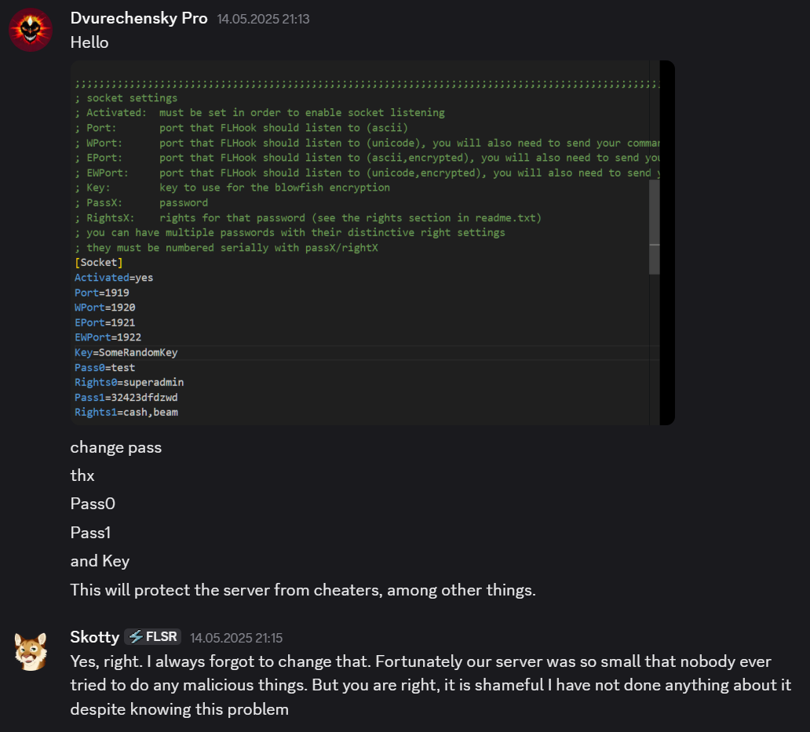

<h1 align="center">🛰️ FreelancerAdminAudit 🛰️</h1>

<p align="center">
  
  
  
  
  
  
</p>

---

> [!NOTE]
> Этот проект является частью экосистемы **Lizerium** и относится к направлению:
>
> * [`Lizerium.Tools.Structs`](https://github.com/Lizerium/Lizerium.Tools.Structs)
>
> Если вы ищете связанные инженерные и вспомогательные инструменты, начните оттуда.

# 🇷🇺 Русское описание 🇷🇺

[English version](README.en.md)

## ⚠️ Важно

> [!WARNING]
> Этот проект опубликован **исключительно в исследовательских и образовательных целях**.  
> Его задача — показать архитектурные и конфигурационные ошибки удалённых административных интерфейсов серверов **Freelancer (2003)**.

> [!IMPORTANT]
> Во время исследования была выявлена проблема удалённого доступа к административной панели на одном из публичных серверов сообщества.  
> О проблеме **было сообщено администраторам**, после чего они внесли исправления. Например [Freelancer: Sirius Revival](https://fl-sr.eu/) или [Freelancer: Rebirth](https://freelancerothe.ucoz.ru/)

> [!CAUTION]
> Если аналогичные конфигурации всё ещё используются на других серверах, они могут быть подвержены тем же рискам.

---

# ❓ Что это такое

**FreelancerAdminAudit** — это простой TCP-клиент для анализа и проверки удалённой административной консоли серверов **Freelancer (2003)**.

С его помощью можно:

- подключаться к административной TCP-панели сервера
- проходить аутентификацию по паролю
- отправлять команды в консоль сервера
- анализировать, насколько опасно и открыто устроен удалённый доступ
- воспроизводить найденные ошибки конфигурации и архитектуры

---

# 🔥 Почему проект вообще появился

Во время технического исследования старых серверных решений для **Freelancer (2003)** я заметил, что часть серверов использует **удалённую административную панель**, доступ к которой строится слишком примитивно:

- открытый TCP-порт
- парольная авторизация
- отсутствие дополнительных ограничений
- отсутствие нормальной сетевой изоляции
- чрезмерно опасные административные команды

В рамках проверки я убедился, что при определённых условиях можно получить доступ к административной панели сервера.

Это не “магический эксплойт”, а демонстрация того, насколько опасной может быть **ошибочная конфигурация** старых игровых серверов.

---

# 💣 Что может быть доступно через такую панель

В зависимости от конфигурации сервера и набора плагинов удалённая консоль может позволять:

- читать информацию об игроках
- получать данные персонажей
- изменять деньги / репутацию / груз
- кикать / банить игроков
- выполнять административные действия
- управлять плагинами
- получать служебную информацию сервера

То есть проблема не в “красивом баге”, а в том, что некоторые серверы исторически держали **слишком мощную админку на слишком слабой защите**.

---

# 🧪 Что делает этот клиент

Программа:

- подключается к указанному IP и порту
- ожидает приглашение к аутентификации
- отправляет пароль
- после успешной авторизации позволяет вручную отправлять команды
- отображает ответы сервера в консоли

---

# 🛠️ Технологии

- **C#**
- **.NET**
- **TCP / Socket communication**
- **ASCII protocol interaction**
- **Legacy game server protocol testing**

---

# 🚀 Пример работы

```text
[+] Подключение установлено.
[<] Welcome to FLHack, please authenticate
[>] Отправлен логин: pass test
[<] OK

Введите команду: help
[>] Отправлена команда: help
[<] Ответ сервера:
[version]
4.0.0-Dormammu plugin
[commands]
getcash <charname>
setcash <charname> <amount>
...
OK
```

---

# Доказательства того что я оповестил авторов серверов

## Freelancer: Sirius Revival


